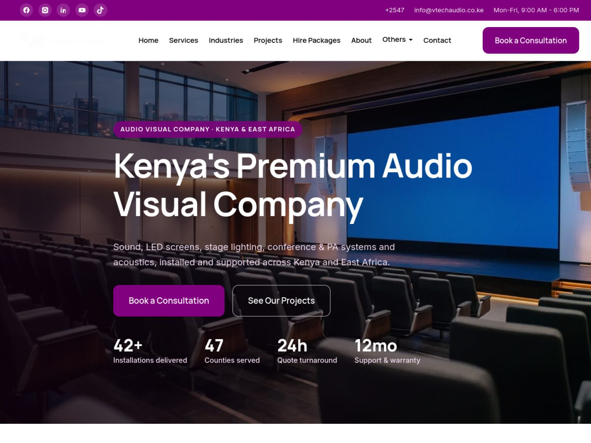

<div align="center">


# VTECH Audio Visual Solutions: WordPress Theme

**Custom, SEO-first WordPress theme powering [vtechaudio.co.ke](https://vtechaudio.co.ke/), an audio visual company in Nairobi, Kenya.**

\
\
\
\
\

[Live site](https://vtechaudio.co.ke/) · [Install guide](vtech-av/docs/INSTALL.md) · [Deploy guide](vtech-av/docs/DEPLOY.md) · [Style guide](vtech-av/docs/STYLE-GUIDE.md)

</div>

---

## Homepage

\

## About the project

VTECH Audio Visual Solutions designs, supplies, installs and hires professional sound and PA systems, LED screens, conference and boardroom AV, stage lighting and acoustic treatment for churches, corporates, hotels, schools, government and events across Kenya.

This repository holds the complete custom theme behind the website: a native Gutenberg build with no page builders, tuned for Core Web Vitals and local search in Kenya.

## Highlights

| Area | What's included |
|---|---|
| **Design system** | `theme.json` palette (#81007F brand purple), self-hosted Manrope and Inter variable fonts, fluid type |
| **Content model** | 8 custom post types (Service, Project, Industry, Equipment, Brand, Testimonial, Case Study, FAQ) and 7 taxonomies |
| **Local SEO and schema** | One canonical LocalBusiness entity shared with Rank Math: NAP, geo, hours, areas served, service and brand catalogue (dB Technologies, Shure, mixers), plus Service, FAQPage, BreadcrumbList and project JSON-LD |
| **Performance** | Inlined critical CSS, preloaded fonts, LCP hero preload, lazy-loading, no jQuery on the front end |
| **Conversion** | Sticky header and CTA, floating WhatsApp and call buttons, quote and site-survey forms, WhatsApp booking links for hire packages |
| **Business tools** | Equipment hire module, inventory, quotes and invoices (PDF), payments, booking acceptance, client logos |
| **Setup** | One-click setup wizard that builds every page, menu and demo entry |
| **Contact details** | Single source of truth in the Customizer, synced into every template, page and schema node |

## Repository structure

```
vtechaudio/
├── vtech-av/                 Parent theme
│   ├── front-page.php        Homepage (renders directly, no pattern dependency)
│   ├── functions.php         Bootstrap and includes
│   ├── inc/
│   │   ├── seo-local.php     Local SEO entity, brands, homepage FAQ schema, Rank Math integration
│   │   ├── seo-meta.php      Meta, OpenGraph, Twitter (defers to Rank Math/Yoast)
│   │   ├── schema.php        Per-page JSON-LD (Service, FAQ, Project)
│   │   ├── breadcrumbs.php   Breadcrumbs and BreadcrumbList
│   │   ├── contact.php       Company contact details and shortcodes
│   │   └── features/         Hire, inventory, quotes, payments, brands, clients
│   ├── assets/               CSS, JS, fonts, icons, images
│   ├── content/              Page copy reference
│   └── docs/                 INSTALL, DEPLOY, STYLE-GUIDE, demo content
├── vtech-av-child/           Child theme for site-specific overrides
└── docs/                     Repository assets (screenshots)
```

## Getting started

1. Zip the `vtech-av` folder, then go to **WP Admin → Appearance → Themes → Add New → Upload Theme** and activate it.
2. Install the recommended plugins shown after activation (Advanced Custom Fields, Contact Form 7, Rank Math SEO).
3. Run **VTECH Setup → Set up my website**, then **Settings → Permalinks → Save Changes** once.
4. Set the company phone, WhatsApp, email, address and hours in **Appearance → Customize → VTECH Theme Options → Company Details**.

Full steps are in [INSTALL.md](vtech-av/docs/INSTALL.md).

## Deployment

Commits to this repository do **not** deploy automatically. To publish a change, upload the updated `vtech-av` theme (zip or SFTP) to the live hosting, then clear any page cache. See [DEPLOY.md](vtech-av/docs/DEPLOY.md).

## Customising SEO data

Brands, services, areas served and homepage FAQs are filterable, so they can be changed from the child theme without editing the parent:

```php
add_filter( 'vtech_seo_brands', function ( $brands ) {
    $brands[] = array( 'brand' => 'Allen & Heath', 'name' => 'Allen & Heath digital mixers', 'category' => 'Audio mixers', 'desc' => '...' );
    return $brands;
} );
```

Available filters: `vtech_seo_brands`, `vtech_seo_services`, `vtech_seo_areas`, `vtech_home_faqs`, `vtech_business_entity`, `vtech_home_seo_title`, `vtech_home_seo_description`.

## Requirements

WordPress 6.4+ · PHP 8.0+ · HTTPS · a page-cache plugin is recommended.

## Credits

Designed and developed by [Pimofy Digital](https://pimofydigital.com/) for VTECH Audio Visual Solutions, Nairobi, Kenya.

## License

GNU General Public License v2 or later. Bundled fonts are licensed under the SIL Open Font License.
